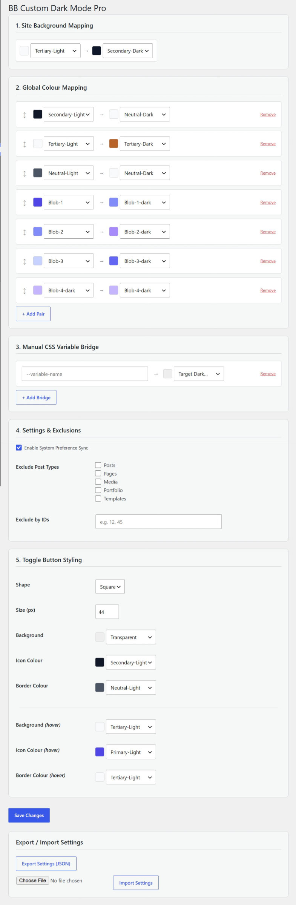

# BB Custom Dark Mode

A pro-grade dark mode engine for [Beaver Builder](https://www.wpbeaverbuilder.com/) that maps your existing Global Colour palette to dark-mode equivalents — no hardcoded hex values, no separate colour management.


[](https://buymeacoffee.com/totaldsgn)

---

## How It Works

When a visitor toggles dark mode, the plugin overrides Beaver Builder's CSS custom properties on `body.dark-mode`:

```css
body.dark-mode {
  --fl-global-your-light-color: var(--fl-global-your-dark-color) !important;
}
```

Because BB renders all module colours as `var(--fl-global-*)` references, a single property swap cascades across every module on the page — no per-module configuration needed. The user's preference is stored in `localStorage` and optionally synced with the OS `prefers-color-scheme` setting.

---

## Features

- **Global Colours Manager** — add, edit, and delete Beaver Builder global colours directly from the plugin settings page. Changes are written to BB's own Global Styles storage, so colours created here appear in BB's colour picker and vice versa. Supports hex, rgb, rgba, and hsl values with a full Iris colour picker including alpha channel.
- **Global Colour Mapping** — visually map any BB Global Colour to its dark-mode counterpart using a live swatch picker
- **Site Background Mapping** — dedicated light → dark background override for `body` and `.fl-page-content`
- **CSS Variable Bridge** — map any CSS custom property (e.g. from a child theme) to a BB Global Colour for dark mode
- **Toggle Button Styling** — control size, shape, background, icon colour, and border via Global Colours
- **Hover State Control** — separate hover colours for button background, icon, and border
- **System Preference Sync** — optionally follow the visitor's OS dark/light preference
- **Exclusions** — exclude specific post types or individual post/page IDs from dark mode
- **Shortcode** — place the toggle button anywhere with `[bb_dark_mode_toggle]`
- **Export / Import** — back up and restore all settings as a JSON file
- **Accessibility** — `aria-pressed` state management, `:focus-visible` keyboard ring, programmatic `blur()` on mouse click to prevent stuck focus states
- **Security hardened** — nonce-verified export/import, capability checks, full input sanitization on every field

---

## Global Colours Manager

The **BB Global Colours** tab lets you manage your Beaver Builder colour palette without leaving the settings page.

**How it works:**

BB stores its global colours in `_fl_builder_styles` under the `colors` array. Our plugin reads from and writes to that same storage using `FLBuilderGlobalStyles::get_settings()` and `save_settings()`. When you add a colour here:

1. It's saved to BB's internal colour palette
2. It appears immediately in BB's **Global Styles → Colors** page
3. It becomes available in all light/dark mapping dropdowns
4. Editing or deleting a colour here updates it everywhere

**Colour format support:**

The Iris color picker accepts hex (`#ff0000`), rgb (`rgb(255,0,0)`), rgba (`rgba(255,0,0,0.5)`), and hsl (`hsl(0,100%,50%)`) values. The alpha slider lets you create semi-transparent colours — the output automatically switches between `#rrggbb` at full opacity and `rgba(r,g,b,a)` when transparency is applied.

**Inline editing:**

Click **Edit** on any colour in the table to rename it or change its value inline. Click **Delete** to remove it permanently from BB's palette.

---

## Screenshot



---

## Requirements

| | Minimum |
|---|---|
| WordPress | 6.0 |
| PHP | 8.0 |
| Beaver Builder | Any version with Global Styles / Global Colours |

---

## Installation

### From the GitHub Releases page

1. Download the latest `bb-custom-dark-mode.zip` from [Releases](../../releases)
2. In WordPress go to **Plugins → Add New → Upload Plugin**
3. Upload the ZIP, click **Install Now**, then **Activate**

### Manual / developer install

```bash
cd wp-content/plugins
git clone https://github.com/ttldsgn/bb-custom-dark-mode.git
```

Activate the plugin from **Plugins → Installed Plugins**.

---

## Configuration

Go to **Settings → BB Dark Mode** in your WordPress admin. The settings are organised into three tabs:

### Tab: BB Global Colours

Add, edit, or delete Beaver Builder global colours. Fill in a **Name**, pick a **Colour** using the Iris picker (with optional alpha/opacity), and optionally provide a **Slug** (auto-generated if left blank). Click **Add Global Colour** to save it to BB's palette.

### Tab: Colour Mapping

#### Site Background Mapping

Pick which BB Global Colour is used as the light-mode page background, and which is the dark-mode replacement. Applied to `body` and `.fl-page-content`.

#### Global Colour Mapping

Add as many light → dark pairs as you need. Each pair tells the plugin: *"in dark mode, replace this light colour variable with this dark colour variable."* Use the **+ Add Pair** button to add rows; drag the ↕ handle to reorder; remove unwanted rows with the **Remove** link.

#### CSS Variable Bridge

For CSS variables that live outside BB Global Styles (child theme, third-party plugin), type the variable name (e.g. `--my-heading-color`) and select the BB Global Colour it should resolve to in dark mode.

### Tab: Settings & Styling

#### Settings & Exclusions

| Option | Description |
|---|---|
| System Preference Sync | Auto-activate dark mode for visitors whose OS prefers dark |
| Exclude Post Types | Don't load dark mode CSS on selected post types |
| Exclude by IDs | Comma-separated post/page IDs to exclude (e.g. `12, 45`) |

#### Toggle Button Styling

| Option | Description |
|---|---|
| Shape | Round or square |
| Size | Button size in px (10–200) |
| Background | Fill colour (BB Global Colour) |
| Icon Colour | SVG stroke colour (BB Global Colour) |
| Border Colour | Border colour (BB Global Colour) |
| Background (hover) | Fill colour on hover |
| Icon Colour (hover) | SVG stroke colour on hover |
| Border Colour (hover) | Border colour on hover |

Any hover field left blank falls back to the base value automatically.

---

## Placing the Toggle Button

Use the shortcode in any BB HTML Module, Code Module, or widget area:

```
[bb_dark_mode_toggle]
```

The button renders as an accessible `<button>` element with sun/moon SVG icons and full ARIA state management.

---

## Export & Import

The **Export / Import Settings** card at the bottom of the settings page lets you:

- **Export** — download your current settings as `bb-dm-settings.json`
- **Import** — upload a previously exported file to restore settings

Both actions require `manage_options` capability and are nonce-verified. Imported data is validated and passed through the same sanitization pipeline as the Settings API.

---

## Security

| Concern | How it's handled |
|---|---|
| Settings sanitization | `register_setting()` sanitize callback sanitizes every field before DB write |
| Export | Requires `manage_options` + valid nonce |
| Import | Requires `manage_options` + valid nonce + `.json` extension + 512 KB size limit + JSON validity check |
| CSS injection | All colour slugs and CSS variable names restricted to `[a-zA-Z0-9\-_]` at save time and at CSS output time |
| Post type exclusions | Validated against registered public post types |
| ID exclusions | Cast to `intval`, compared with strict type checking |
| External requests | None — no data leaves your server |

---

## Changelog

See [CHANGELOG.md](CHANGELOG.md) for the full version history.

---

## Open Source

This plugin is released as-is with no promise of support, updates, or responses to bug reports. It is fully open source — you are encouraged to fork it, adapt it, extend it, or take it in an entirely different direction. No attribution required, though always appreciated.

---

## License

Released under the [GNU General Public License v2.0](https://www.gnu.org/licenses/old-licenses/gpl-2.0.html) or later, in keeping with WordPress licensing requirements.

---

## Author

**ttldsgn**

[](https://buymeacoffee.com/totaldsgn)